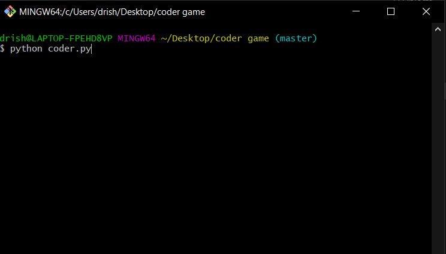
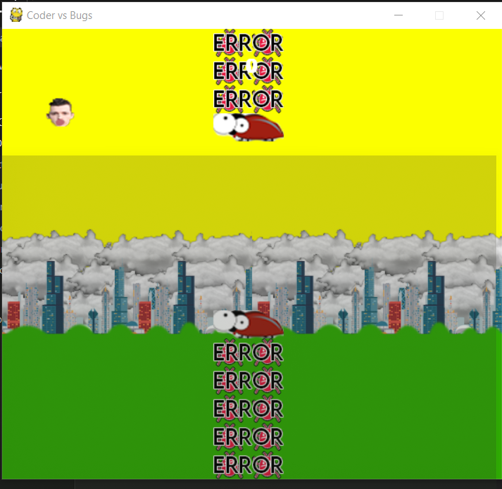
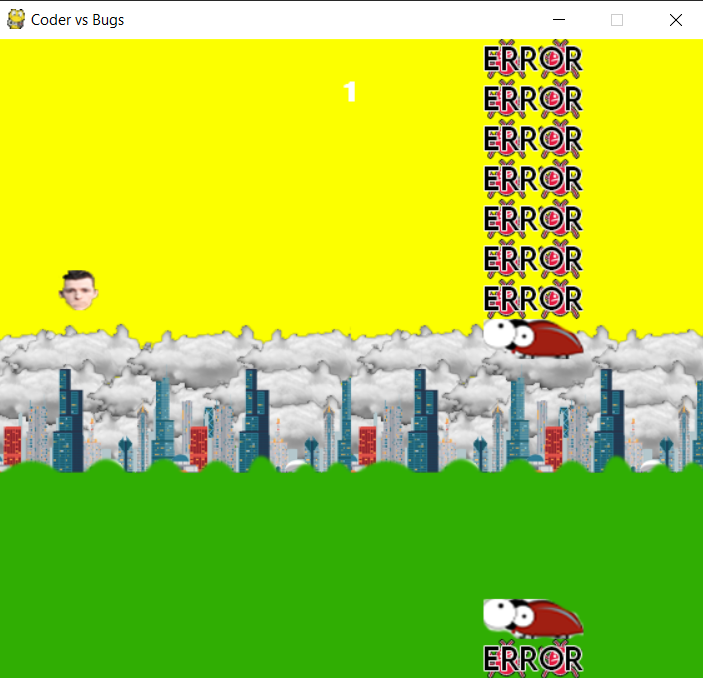

# Coder vs Bugs

When I started coding to make a game using pygame, I did not think I'd end up with this. I was trying to make a clone of the 2013's addicting game "Flappy Bird".
As the project came to conclusion, a different idea using the same concept came to my mind, resulting to the game you're seeing right now.
The game is simple, a coder tries avoiding bugs and errors, and when he/she meets one, the game is terminated.  

## Table of Contents

- [Installation](#installation)
- [Usage](#usage)
- [Contributing](#contributing)
- [Screenshots](#Screenshots)

## Installation

```sh
*Local Installation
	Clone this repository on your machine, open a command terminal, write "python coder.py" and press Enter.
	You shouldhave python installed and if not, install python first.
*Live Version
	The live version of the game is available at https://repl.it/@DrishtantRegmi/coderpygame 
```

## Usage

The game starts instantly and to survive, you'll have to make sure that you do not crash with the bugs or fall down. Each mouse click bounces you above, and idly, you fall down.
So balance the mouse click and avoid the bugs in order to survive.


## Contributing

Drishtant Regmi, Reduct Nepal

## Screenshots




